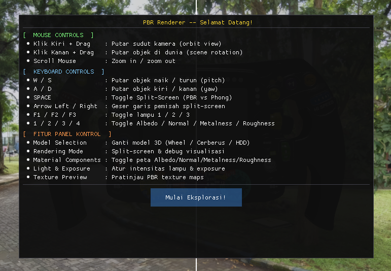

#  Simulasi PBR (Physically Based Rendering)

Selamat datang di proyek Simulasi Grafika Komputer! Aplikasi ini dibuat untuk mendemonstrasikan bagaimana cahaya berinteraksi dengan benda 3D di dunia nyata (menggunakan teknik **PBR**) dan membandingkannya dengan teknik pencahayaan jadul (**Phong Shading**).

<p align="center">
  
</p>

---

## Fitur Terbaru

Versi ini telah dirombak secara besar-besaran untuk memudahkan pengguna:
1. **Antarmuka 100% Bahasa Indonesia**: Seluruh panel kontrol dan menu kini berbahasa Indonesia agar mudah dipahami.
2. **Pilihan Multi-Model 3D**: Anda bisa mengganti model 3D secara langsung! Tersedia:
   *  F1 Wheel (Ban Mobil F1)
   *  Cerberus Gun (Pistol)
   *  Hard Disk Drive (HDD)
3. **Pilihan Lingkungan HDR**: Ganti suasana pencahayaan dunia secara instan:
   *  Gedung FT Outdoor
   *  Indoor
   *  Outdoor 2
4. **Layar Sambutan & Panduan (Help)**: Terdapat layar pengenalan di awal, dan tombol tanda tanya `(?)` di panel kontrol untuk memunculkan panduan kontrol kapan saja.

---

## Cara Mengunduh (PENTING)

Proyek ini mengandung file 3D dan tekstur gambar berkualitas sangat tinggi (ukuran mencapai ~300 MB). File-file berat ini disimpan khusus menggunakan **Git LFS (Large File Storage)**. 

Ada dua cara untuk mengunduhnya:

### Cara 1: Download Langsung (Paling Mudah untuk Orang Awam)
1. Pergi ke bagian atas halaman GitHub ini.
2. Klik tombol hijau bertuliskan **Code**.
3. Pilih **Download ZIP**.
*(Catatan: GitHub akan otomatis memasukkan file besar LFS ke dalam ZIP, sehingga Anda tinggal mengekstraknya tanpa perlu alat tambahan).*

### Cara 2: Menggunakan Terminal (Untuk Programmer)
Pastikan Anda sudah menginstal **Git** dan **Git LFS** di komputer Anda. Buka terminal dan ketik:
```bash
# Wajib install Git LFS dulu jika belum punya
git lfs install

# Unduh branch revisi ini beserta file 3D besarnya
git clone -b revisi-final-rayhan https://github.com/rawwr/TA-Grafika.git
```

---

##  Cara Menjalankan Aplikasi (Windows)

Sangat mudah! Anda **tidak perlu** mengetik perintah rumit.
1. Buka folder proyek yang sudah Anda download/ekstrak tadi.
2. Cari file bernama `build.bat` dan **klik dua kali (Double Click)**.
3. Tunggu jendela terminal hitam berproses. Jika sukses, aplikasi PBR 3D akan **terbuka secara otomatis**!

*(Catatan: Anda membutuhkan CMake dan MinGW terinstal di komputer Windows Anda agar proses kompilasi awal berhasil).*

---

##  Panduan Kontrol

| Aksi | Tombol / Mouse |
| :--- | :--- |
| **Putar Kamera** | Klik Kiri Mouse + Geser (Drag) |
| **Putar Objek 3D** | Klik Kanan Mouse + Geser (Drag) **ATAU** tombol `W`, `A`, `S`, `D` |
| **Perbesar/Perkecil** | Scroll Mouse (Roda Mouse) |
| **Layar Terbelah** | Tekan `Spasi` (Untuk melihat PBR vs Phong) |
| **Geser Garis Layar**| Panah `Kiri` atau `Kanan` di keyboard |
| **Lampu Manual** | Tekan `F1`, `F2`, atau `F3` |

### Komponen Tekstur PBR (Bisa di-ON/OFF via angka keyboard):
* `1` : **Albedo** (Warna cat dasar)
* `2` : **Normal Map** (Bentuk relief/tekstur kasar mikro)
* `3` : **Metalness** (Sifat logam mengkilap)
* `4` : **Roughness** (Tingkat keburaman/kekasaran permukaan)
<p align="center">
  
</p>
---

##  Manual Book
Bagi mahasiswa atau publik yang ingin melihat penjelasan akademis lengkap, Anda dapat membaca dan mengunduh file PDF panduannya pada folder `data/MANUAL BOOK GRAFKOM.pdf`.

*Hak Cipta (c) 2017-2018 Michał Siejak (Base Code), Dimodifikasi dan Dikembangkan lebih lanjut untuk Tugas Akhir Grafika Komputer (Revisi).*
